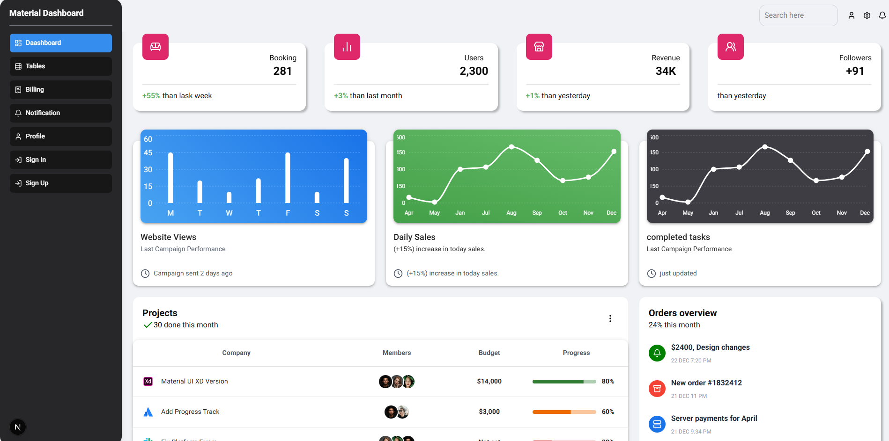
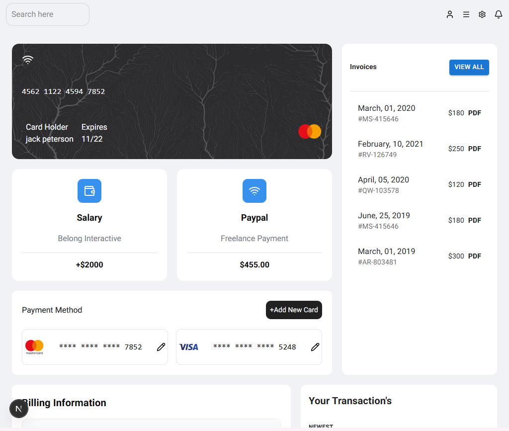
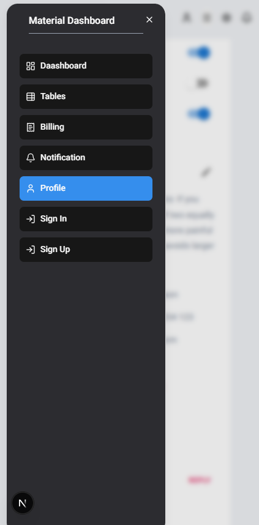

# 🚀 Material Dashboard - Admin Panel

A modern and fully responsive **Admin Dashboard** built with **Next.js**, **TypeScript**, **Material UI**, **Tailwind CSS**, and **shadcn/ui**.

The project recreates a professional dashboard UI inspired by Material Dashboard while following modern React and Next.js best practices.

---

## 📸 Preview

### Dashboard

<p align="center">
  
</p>

### Billing

<p align="center">
  
</p>

### Menu

<p align="center">
  
</p>


## 🌐 Live Demo

👉 **Demo:** https://your-demo-link.vercel.app

---

# ✨ Features

- 📱 Fully Responsive Design
- 🎨 Modern Material UI Interface
- ⚡ Built with Next.js App Router
- 🔥 TypeScript Support
- 🎯 Material UI Components
- 🎨 Tailwind CSS Styling
- 🧩 shadcn/ui Components
- 🎭 Lucide React Icons
- 📋 Formik Form Management
- ✅ Yup Validation
- 🔐 Login & Registration
- 🌐 MockAPI Integration
- 📊 Dashboard Page
- 👤 Profile Page
- 🔔 Notifications Page
- 💳 Billing Page
- 📑 Tables Page
- 📈 Charts
- 🎨 Clean Folder Structure

---

# 🛠️ Tech Stack

| Technology | Usage |
|------------|-------|
| Next.js 16 | Framework |
| React 19 | UI Library |
| TypeScript | Type Safety |
| Material UI | UI Components |
| Tailwind CSS | Utility Styling |
| shadcn/ui | UI Components |
| Formik | Form Management |
| Yup | Form Validation |
| MockAPI | Authentication API |
| Lucide React | Icons |

---

# 🔐 Authentication

Authentication pages include:

- Sign In
- Sign Up

Features:

- Form validation using **Formik + Yup**
- Email validation
- Password validation
- Authentication with **MockAPI**
- Error handling
- Responsive layout

---

# 📂 Pages

- Dashboard
- Profile
- Billing
- Notifications
- Tables
- Sign In
- Sign Up

---

# 📱 Responsive Design

The entire application is fully responsive.

Optimized for:

- 📱 Mobile
- 📱 Tablet
- 💻 Laptop
- 🖥️ Desktop


---


# 📁 Folder Structure

```
app/
 ├── (auth)
 │    ├── sign-in
 │    └── sign-up
 │
 ├── (dashboard)
 │    ├── dashboard
 │    ├── profile
 │    ├── billing
 │    ├── notification
 │    ├── tables
 │    └── layout
 │
 ├── component
 ├── context
 └── layout.tsx

public/
components/
lib/
```

---

# 🎯 Highlights

- Responsive Material Dashboard
- Reusable Components
- Clean Architecture
- TypeScript
- Modern UI
- Authentication Flow
- MockAPI Integration
- Form Validation
- Responsive Navigation
- Responsive Tables
- Responsive Cards

---


# 👨‍💻 Author

**Setare Homadian**

GitHub

https://github.com/setarehomadian80

---

# ⭐ Support

If you like this project, don't forget to ⭐ the repository.
